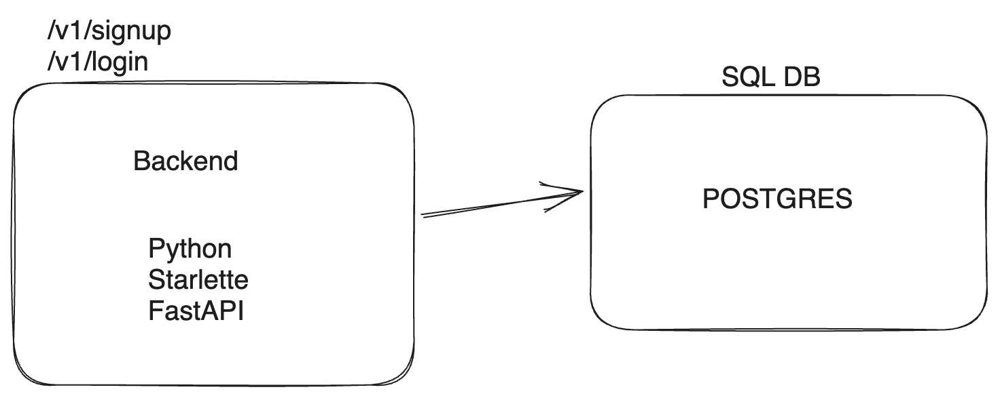

## What is this ?
- A sample application that has ORM support for User Models, can does CRUD ops on top on a SQL type DB, postgres support is included in the box but you can use anything you want 

## Tech Stack ? 
- FastApi [Controller, /login and /signup support]
- Postgres [SQL DB]
- Locust/Vegeta [Load Test Support]
- Docker for images
- K8s for deployment orchestration
- Helm for K8s management 

## Why this ? 
- A lot of interviews would ask you to create a full stack DB application that has these components. 
- A DB [State Support; Push the application state in form of pojos to tables]
- A Controller [HTTP Server; Support HTTP Protocol and push out a bunch of APIs using json in request/response flows]
- A Auth Token Manager [A simple JWT type thingy would work out of box here !]
- Some custom business Logic 
        
        - [Maybe support a zerodha type investment ledger and support ROI calculation and TOTAL_PORTFOLIO calculation at any time X]
        
        - [Maybe a custom ticker manager; give out train/parking tickets]
        
        - [Some Random Problem]
=

## HLD

## How does this help ?
- The auth module takes care of /signup and /login flow with auth_token [Authorisation : Bearer <AUTH_TOKEN>] type support.

- Writing custom business logic becomes easier from here on. 

- You have to design DataBase Tables for your custom business logic, and a LLD and HLD diagrams.

- Add business logic modules inside src/* as individual building blocks and then just include the router inside src/server. 

## How to run ? 
- Make sure docker-compose in installed and docker-daemon in running. Read Docker is you are a noobie !

- run `docker-compose -f dev/docker-compose-dev.yml build` and `docker-compose -f dev/docker-compose-dev.yml up`

- goto : localhost:8890/docs to test out the APIs

## North Star ? 
- Use K8s to orchestrate the pods, all the components should be horizontal scalable.
- The controller written in fastApi, for postgres read and implement primaryKey based sharding. 
- Add support for multiple db replicas, and support for rebalance.
- Load Test each pod and come up with numbers !
- Might use this sometime in future, for User pojo thingy !
 

## RoadMap 
- 1. Adding support for Tests; inside tests/
- 2. Solve a problem on top of this

 

